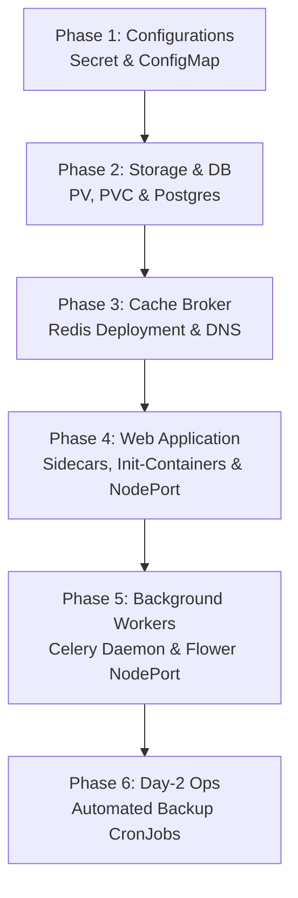

# Kubernetes DevOps Study Guide & Roadmap

This roadmap provides a step-by-step path to study, deploy, and understand the Kubernetes (K8s) manifests in this project. By following this guide, you will master K8s architecture, networking, storage, init-containers, multi-container pods, and cron jobs.

---

## 🧭 The Learning Roadmap



---

## Phase 1: Environment Configuration
*Focus on how Kubernetes handles configurations and credentials.*

### 1. What to Read:
* Open and study **[k8s-configmap-secret.yaml](k8s-configmap-secret.yaml)**.

### 2. Core Concepts:
* **Secret**: Stores sensitive parameters (Postgres credentials). They are Base64-encoded in the manifest file, but decrypted inside the container at runtime.
* **ConfigMap**: Stores non-sensitive keys (DEBUG, URLs, DB Host).

### 3. Study Exercises:
* Try encoding a custom string to Base64 in your terminal:
  ```bash
  echo -n 'my-new-secret-key' | base64
  ```
* Locate where variables are imported into the Django app container in `django-app.yaml` using `secretKeyRef` and `configMapKeyRef`.

---

## Phase 2: State and Storage (PostgreSQL)
*Learn how Kubernetes manages persistent state.*

### 1. What to Read:
* Open and study **[postgres-db.yaml](postgres-db.yaml)**.

### 2. Core Concepts:
* **PersistentVolume (PV)**: Physical storage allocated on the node's host path.
* **PersistentVolumeClaim (PVC)**: The request made by the database to claim that storage.
* **Probes**: 
  * `readinessProbe` checks if the database is ready to accept client connections.
  * `livenessProbe` restarts the database if it crashes.

### 3. Study Exercises:
* Look at the postgres deployment's `env` section. Note how it maps `POSTGRES_DB`, `POSTGRES_USER`, and `POSTGRES_PASSWORD` from the Secret created in Phase 1.
* Why is the replica count set to `replicas: 1`? *(Answer: Because multiple active DB replicas writing to the same storage will cause data corruption. We use stateful sets or master-replica patterns for replication).*

---

## Phase 3: Broker Cache & Service DNS (Redis)
*Learn how pods discover and communicate with each other.*

### 1. What to Read:
* Open and study **[redis-broker.yaml](redis-broker.yaml)**.

### 2. Core Concepts:
* **ClusterIP Service**: Exposes a pod internally inside the cluster. It creates a stable, cluster-wide DNS hostname (e.g., `redis-service`).
* **Service Discovery**: Pods communicate using the service name (e.g. `redis-service:6379`) instead of IP addresses. Kubernetes automatically resolves these hostnames using its core DNS server (CoreDNS).

### 3. Study Exercises:
* Compare the postgres service and the redis service definitions. Notice how both are `type: ClusterIP`.
* Verify the selector labels: The service `selector: app: redis` MUST match the deployment pod template `labels: app: redis` so K8s knows where to route traffic.

---

## Phase 4: Multi-Container Pods & Lifecycle (Django + Nginx)
*Master advanced application lifecycle patterns.*

### 1. What to Read:
* Open and study **[django-app.yaml](django-app.yaml)**.

### 2. Core Concepts:
* **Init-Container (`init-migrate`)**: A container that runs and exits before the app container starts. It waits for PostgreSQL to become online, and then automatically runs database migrations (`python manage.py migrate`).
* **Multi-Container Pod**: Two containers (`django` and `nginx`) running inside the same Pod.
  * **Networking**: They share `localhost`. Nginx forwards traffic to `127.0.0.1:8000`.
  * **Storage Sharing**: They mount the same `emptyDir` volume (`static-volume`). Django writes collected static assets into it, and Nginx reads them read-only (`:ro`) to serve static URLs directly.
* **NodePort Service**: Exposes Nginx externally on port `30080` of the K8s node so host browsers can access the page.

### 3. Study Exercises:
* Study the `init-migrate` shell script loop. How does it wait for the database?
* Look at `env` inside the `django` container. How does K8s dynamically compose `DATABASE_URL`? *(Answer: By using `$(VAR)` syntax to reference variables defined earlier in the list).*

---

## Phase 5: Asynchronous Workers (Celery & Flower)
*Understand scaling and monitoring background tasks.*

### 1. What to Read:
* Open and study **[celery-worker.yaml](celery-worker.yaml)** and **[flower-monitor.yaml](flower-monitor.yaml)**.

### 2. Core Concepts:
* **Celery Worker**: Runs the worker daemon. It has no service exposed because it doesn't receive network requests; it pulls tasks from Redis.
* **Flower Monitor NodePort**: Exposes Flower dashboard externally on port `30055`.

### 3. Study Exercises:
* How does Celery discover the Redis broker host? *(Answer: Through `CELERY_BROKER_URL` which references the DNS name `redis-service:6379` loaded from the ConfigMap).*

---

## Phase 6: Automated Backups (CronJobs)
*Learn how to schedule tasks and perform disaster recovery.*

### 1. What to Read:
* Open and study **[postgres-backup-cronjob.yaml](postgres-backup-cronjob.yaml)** and **[BACKUP_GUIDE.md](BACKUP_GUIDE.md)**.

### 2. Core Concepts:
* **CronJob**: A controller that schedules Jobs on a timeline.
* **Recovery (Restore)**: Wiping database tables and importing a compressed backup using `kubectl exec` and `zcat`.

### 3. Study Exercises:
* Study the `schedule: "0 2 * * *"` setting. What does it mean? *(Answer: At 2:00 AM every day).*
* Read through the recovery guide in `BACKUP_GUIDE.md`. Practice explaining to yourself why we scale down the application replicas before restoring database files.
